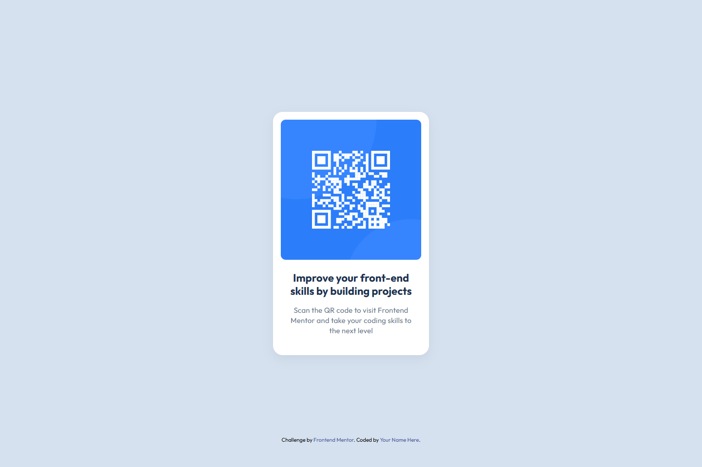
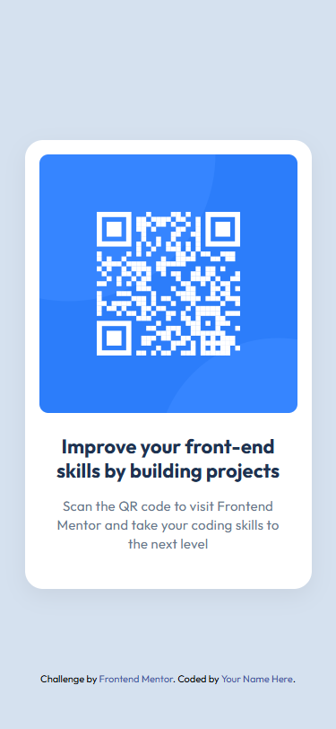

# Frontend Mentor - QR Code Component 🚀

This is my solution to the [QR Code Component challenge on Frontend Mentor](https://www.frontendmentor.io/challenges/qr-code-component-iux_sIO_H).  
Frontend Mentor challenges help you improve your coding skills by building realistic and practical projects.

## 📑 Table of Contents

- [Overview](#overview)
  - [Screenshot](#screenshot)
  - [Links](#links)
- [My Process](#my-process)
  - [Built With](#built-with)
  - [What I Learned](#what-i-learned)
  - [Continued Development](#continued-development)
- [Acknowledgments](#acknowledgments)

## 📌 Overview

### 📷 Screenshot

---

### 🔗 Links

- **Solution URL:** [Add solution URL here](https://your-solution-url.com)
- **Live Site URL:** [Add live site URL here](https://your-live-site-url.com)

---

## 💪 My Process

### 📂 Built With

- **Semantic HTML5** markup
- **CSS Flexbox** for layout
- **Responsive design** best practices

### 📚 What I Learned

I learned how to structure a semantic HTML document 🧩, apply clean and consistent styles, and improve my responsive design workflow 📱.  
This challenge also helped me manage my time better and focus on building small, reusable UI components — in this case, an information card with an image (the QR code).

### 🔄 Continued Development

I want to keep improving my **CSS styling techniques** and mastering **semantic HTML** with best practices in mind.  
My goal is to create **beautiful and accessible user interfaces** where users can navigate naturally and intuitively ✨.

## 🙌 Acknowledgments

Although this challenge is not particularly complex, it’s a great exercise for reinforcing the **fundamentals of web development** — HTML and CSS.  
I highly recommend starting with challenges like this if you’re new to web development.

Here are my tips:

- Go step by step, making sure you **understand each stage** before moving on.
- Pay close attention to the design details.
- Don’t be afraid to use tools or references, but always make sure you **understand why** you are using a particular approach.
- Most importantly — **have fun while coding!** 😄
